# DAANet: Dual Ask-Answer Network for Machine Reading Comprehension
[](https://opensource.org/licenses/MIT)    [](https://opensource.org/licenses/MIT)  


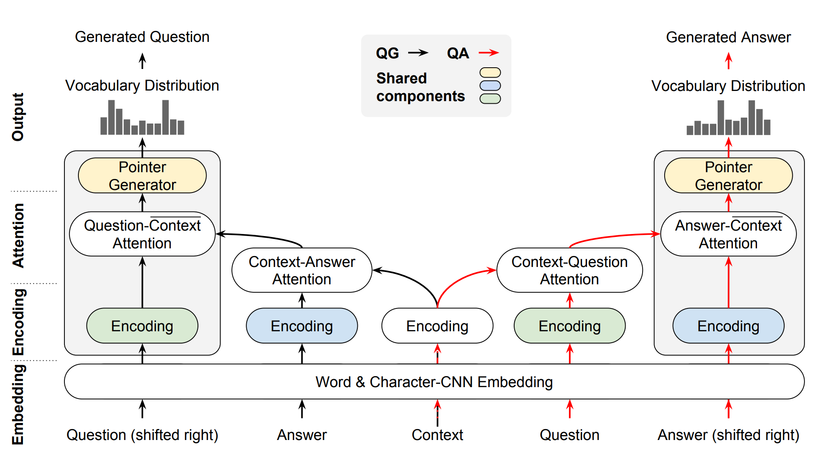

## Requirements

- Python >= 3.6
- Tensorflow >= 1.6 (self-compiled TF-gpu is recommended!)
- gputil >= 1.3.0
- GPU

## Usage
For dual learning run:
```
python grid_search.py daanet 
```
For QA-only model (corresponds to `mono` in the experiment) run: 
```
python grid_search.py monoqa 
```
For QG-only model (corresponds to `mono` in the experiment) , run :
```
python grid_search.py monoqg 
```

All hyperparameters used in the paper are stored in `default.yaml`:

You can change the data path and save dir in `grid.yaml`


## Evaluation

Evaluation on the dev set is automatically done after each epoch.

To do evaluation manually,

```bash
python app.py evaluate ~/save/models/DDMM-HHMMSS/default.yaml
```

, where `~/save/models/DDMM-HHMMSS/default.yaml` is the saved yaml config of model `DDMM-HHMMSS`. It is created during the training procedure. It automatically loads the parameters from the best epoch (or fallback to the last epoch) to the model.


## Continuous Training
```bash
python app.py train ~/save/models/DDMM-HHMMSS/default.yaml
```
It will load the best (or last) model so far and conducts incremental training.

## Generated Samples
Selected outputs from DAANET and mono. Yellow text is question-related; green text is answer-related.

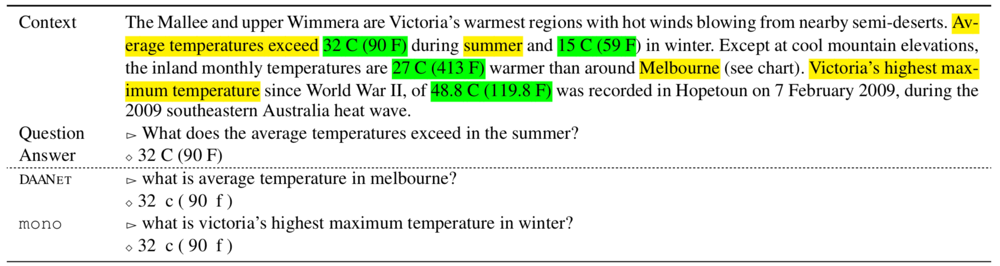
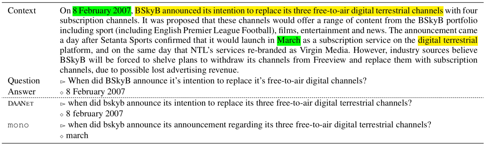
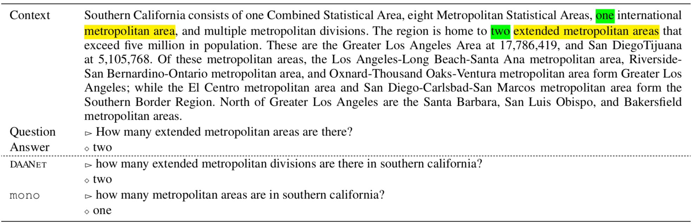
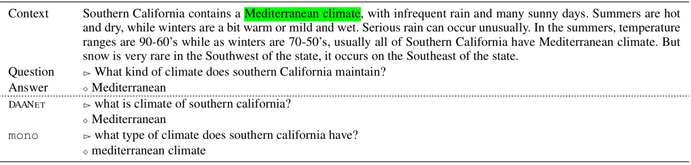
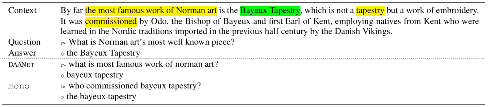
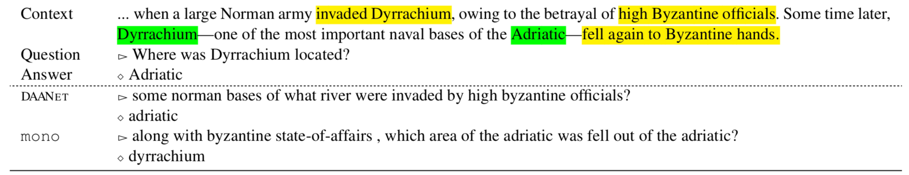
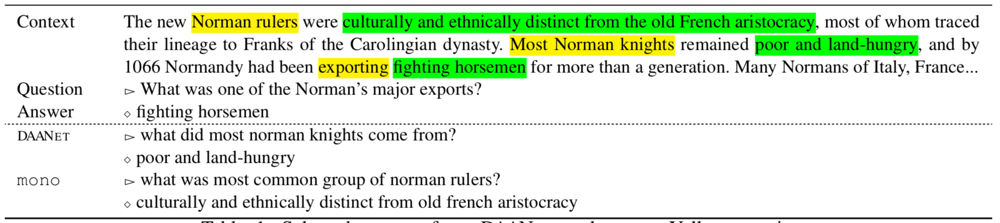


## Attention Matrix
Question-Context and Answer Context attention matrices

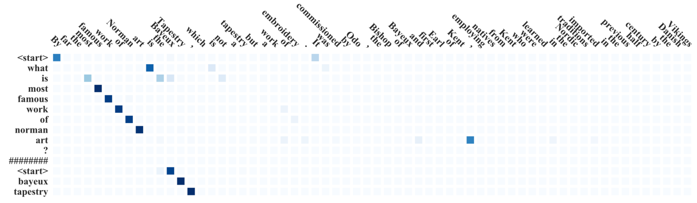
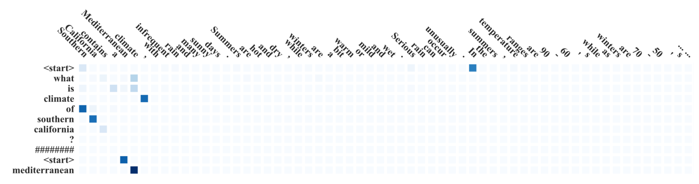
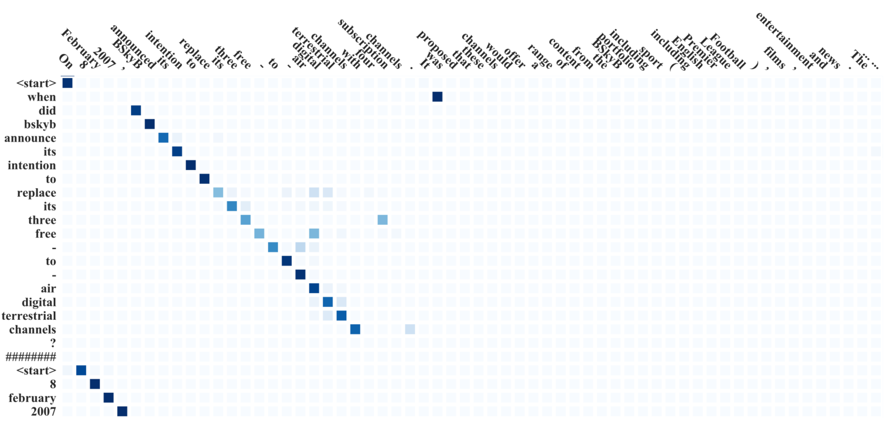
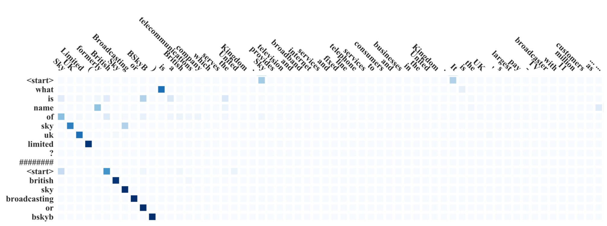
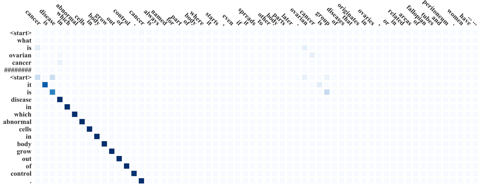
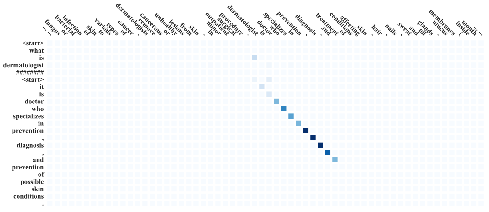
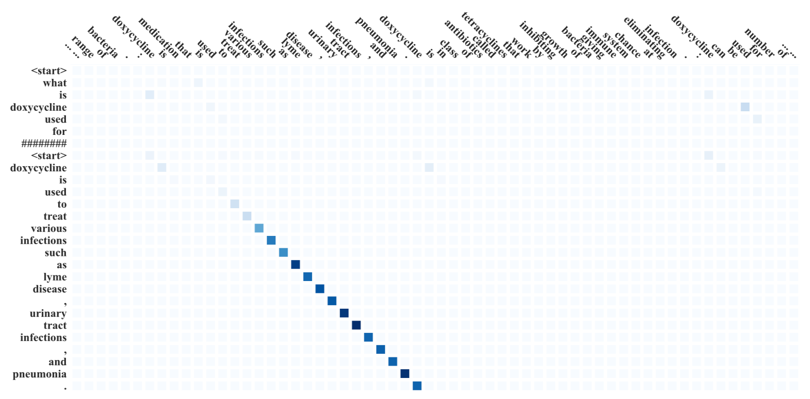
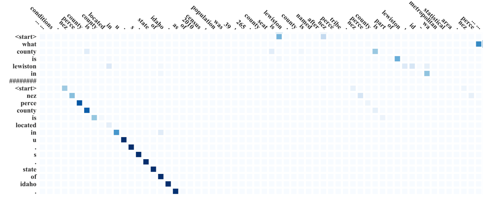
